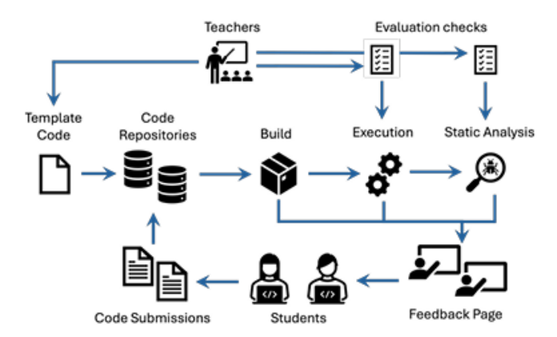

# LLM per la Valutazione Automatica di Esercizi di Sistemi Operativi

Questa repository contiene i materiali della tesi magistrale in **Ingegneria Informatica**, focalizzata sull’uso dei **Large Language Models (LLM)** per la valutazione automatizzata di programmi concorrenti. Il progetto integra strumenti di test dinamici e analisi statica con **Semgrep**, fornendo diagnosi dettagliate e feedback contestualizzati agli studenti.

---

## Contesto

Lo sviluppo di programmi concorrenti richiede attenzione a problematiche complesse:

- Sincronizzazione tra processi e thread (race condition, deadlock)
- Gestione di risorse IPC (semafori, code di messaggi, memoria condivisa)
- Ordine e coerenza dei messaggi scambiati

I test dinamici tradizionali non sempre rilevano errori dovuti a interleaving non deterministico o protocolli complessi. L'analisi statica con **Semgrep**, tramite regole personalizzate, consente di individuare errori strutturali nel codice.

### Pipeline originale

  


---

## Architettura del Sistema

La pipeline combinata è composta da:

1. **Test Dinamici** – verifica esecuzione del codice  
2. **Analisi Statica** – regole Semgrep personalizzate  
3. **Classificazione Fallimenti** – assegnazione a una delle sei categorie  
4. **Analisi LLM Primario** – diagnosi testuali di output e codice  
5. **LLM Giudice** – verifica semantica confrontando con la ground truth  
6. **Salvataggio dei Risultati** – output in file JSON strutturati per ogni esercizio e commit  

### Diagramma concettuale del flusso

  

### Struttura del Repository per Esercitazione

  

---

## Metodologia

- **Dataset:** repository degli studenti per 5 esercitazioni: semafori, monitor, threads, messaggi, server multithread  
- **Strumenti:** Python, Bash, WSL, Semgrep, Groq, Azure OpenAI GPT-4o  
- **Prompt Engineering:** template per LLM primario e giudice, con regole dettagliate per diagnosi accurate  
- **Categorie di fallimento:** `compile failure`, `crash`, `timeout`, `IPC leak`, `dynamic failure`, `static failure`, `correct`  
- **Validazione:** LLM giudice verifica coerenza diagnosi con output dei test e codice corretto  

---

## Esperimento 1.0 (Threads)

1. Input al modello:
   - Traccia dell’esercizio
   - Codice dello studente  
2. Esecuzione del codice → generazione output  
3. Analisi LLM primario:
   - Verifica correttezza output  
   - Diagnosi testuale del problema  
   - Identificazione punto del codice dove si verifica l’errore  
4. Validazione LLM giudice:
   - Confronto output con feedback dei test dinamici  
   - Confronto codice con soluzione corretta  
5. Output finale strutturato:
   - **Esecuzione corretta (output)**: YES/NO  
   - **Codice corretto (code)**: YES/NO  
   - Diagnosi dettagliata e motivazione  


---

## Risultati

- Riconoscimento accurato di fallimenti evidenti: `crash`, `timeout`, `IPC leak`  
- Buona capacità di individuare e descrivere difetti complessi  
- Limitazioni riscontrate in diagnosi di output con strutture ridotte o protocolli complessi  
- Risultati raccolti in **JSON** per analisi statistiche e visualizzazioni grafiche  

Esempio struttura JSON per un commit:

```json
{
  "student": "nome_studente",
  "exercise": "nome_esercizio",
  "failure_category": "compile_failure | crash | timeout | ipc_leak | dynamic_failure | static_failure | correct",
  "llm_Output_Correct": "YES/NO",
  "llm_Output_Diagnosis": "diagnosi_output",
  "llm_Code_Correct": "YES/NO",
  "llm_Code_Diagnosis": "diagnosi_codice",
  "judge_Output_Correct": "YES/NO",
  "judge_Output_Motivation": "motivazione_giudice",
  "judge_Code_Correct": "YES/NO",
  "judge_Code_Motivation": "motivazione_giudice"
}
````

---

## Conclusione

L’integrazione tra test dinamici, analisi statica e LLM:

* Migliora la valutazione automatizzata dei programmi concorrenti
* Fornisce feedback dettagliati e contestualizzati agli studenti
* Riduce il carico di lavoro dei docenti, aumentando affidabilità e coerenza

---

## Riferimenti e Ringraziamenti

* Tesi di laurea magistrale: Andrea Esposito, “Studio di Large Language Models a supporto della valutazione di programmi concorrenti”, Univ. Federico II, Napoli, 2025/2026
* Relatori: Prof. Roberto Natella, Prof. Luigi De Simone
* Collaboratori: Ph.D. Carmine Cesarano, Dott. Luciano Pianese
