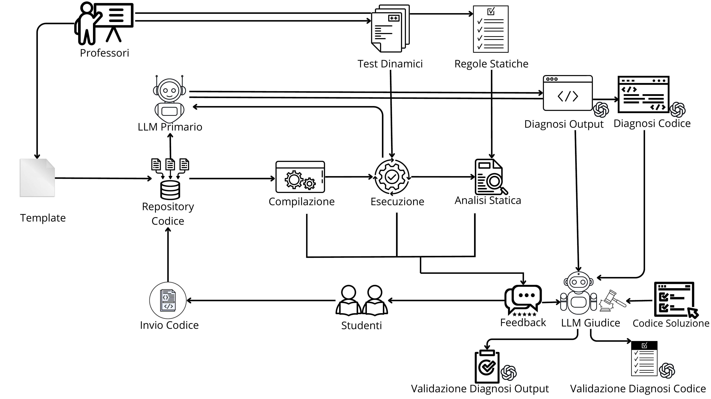
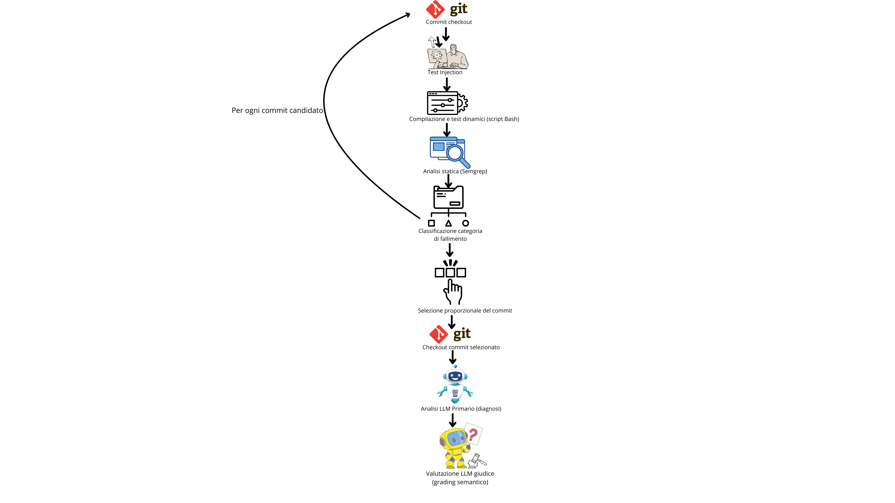
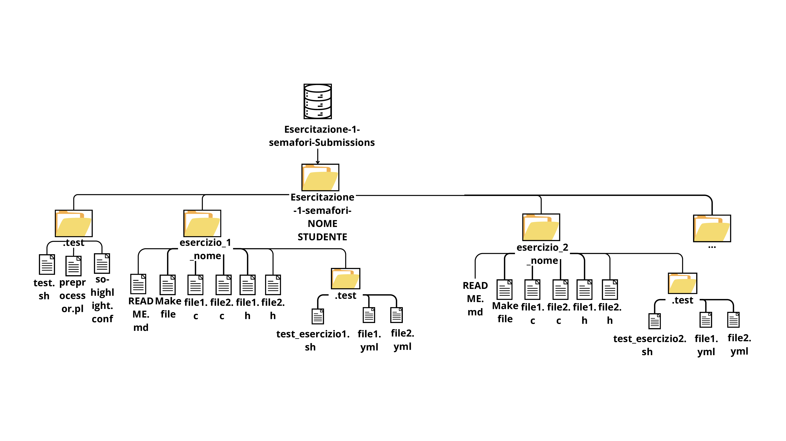

# LLM per la Valutazione Automatica di Esercizi di Sistemi Operativi

Questa repository contiene i materiali della tesi magistrale in **Ingegneria Informatica**, focalizzata sull’uso dei **Large Language Models (LLM)** per la valutazione automatizzata di programmi concorrenti. Il progetto integra strumenti di test dinamici e analisi statica con **Semgrep**, fornendo diagnosi dettagliate e feedback contestualizzati agli studenti.

---

## Contesto

Lo sviluppo di programmi concorrenti richiede attenzione a problematiche complesse:

- Sincronizzazione tra processi e thread (race condition, deadlock)
- Gestione di risorse IPC (semafori, code di messaggi, memoria condivisa)
- Ordine e coerenza dei messaggi scambiati

I test dinamici tradizionali non sempre rilevano errori dovuti a interleaving non deterministico o protocolli complessi. L`analisi statica con **Semgrep**, tramite regole personalizzate, consente di individuare errori strutturali nel codice.

### Pipeline di analisi



---

## Architettura del Sistema

La pipeline combinata è composta da:

1. **Test Dinamici** – verifica esecuzione del codice  
2. **Analisi Statica** – regole Semgrep personalizzate  
3. **Classificazione Fallimenti** – assegnazione a una delle sei categorie  
4. **Analisi LLM Primario** – diagnosi testuali di output e codice  
5. **LLM Giudice** – verifica semantica confrontando con la ground truth  
6. **Salvataggio dei Risultati** – output in file JSON strutturati per ogni esercizio e commit  

### Diagramma concettuale del flusso

  

### Struttura del Repository per Esercitazione

  

---

## Metodologia

- **Dataset:** repository degli studenti per 5 esercitazioni: semafori, monitor, threads, messaggi, server multithread  
- **Strumenti:** Python, Bash, WSL, Semgrep, Groq, Azure OpenAI GPT-4o, GPT-OSS-20b  
- **Prompt Engineering:** template per LLM primario e giudice, con regole dettagliate per diagnosi accurate  
- **Categorie di fallimento:** `compile failure`, `crash`, `timeout`, `IPC leak`, `dynamic failure`, `static failure`, `correct`  
- **Validazione:** LLM giudice verifica coerenza diagnosi con output dei test e codice corretto
  
---

## Script Principali

Gli script risiedono nella cartella `Script-Utilizzati/`.

### Script Bash — `Script-Bash-Only-Test-EsN.sh` (N = 1…5)

Uno script per esercitazione. Itera su tutti i commit di tutti gli studenti, esegue compilazione, test dinamici e analisi statica Semgrep con le regole custom, e produce il file `risultati_esN_tutti_commit_bash.json`.

| Flag | Descrizione |
|---|---|
| _(nessun flag)_ | Modalità batch: analizza tutti gli studenti e tutti i commit |
| `--single-student-commit --student-dir <dir> --commit <hash>` | Analisi di un singolo commit |

Output prodotto per ogni commit: `compile_success`, `test_success`, `stdout`, `stderr`, `program_output`, `static_warnings`, `failure_category`.

---

### Script LLM — `Script-LLM-Esperimento1.0.py`

Script di prima generazione per la pipeline LLM, usato per le esercitazioni 1–5. Supporta provider **Groq** (multi-chiave con rotazione automatica) e **Azure OpenAI**. Legge il file `risultati_esN_tutti_commit_bash.json`, seleziona i commit da analizzare, li sottopone ai prompt LLM e salva i risultati arricchiti in `risultati_esN.json`.

Variabili d'ambiente:

```bash
export LLM_PROVIDER=groq          # o "azure"
export GROQ_API_KEYS="key1,key2"  # rotazione automatica in caso di rate limit
export AZURE_OPENAI_ENDPOINT="https://..."
export AZURE_OPENAI_API_KEY="..."
export AZURE_OPENAI_MODEL_DEPLOYMENT="gpt-4o"
```

---

### Script LLM con VPN — `Script-LLM-Esperimento1.0-v2-with_VPN.py`

Versione estesa, con supporto aggiuntivo per un modello remoto (`gpt-oss-20b`) accessibile tramite VPN (FortiClient). Aggiunge:

- Provider `remote-gpt`: client OpenAI-compatibile puntato su endpoint privato via VPN
- Parallelizzazione delle richieste con semafori separati per modello primario e giudice (`REMOTE_GPT_PRIMARY_PARALLEL_REQUESTS`, `REMOTE_GPT_JUDGE_PARALLEL_REQUESTS`)
- Tracciamento dei token e calcolo del costo per ogni chiamata

```bash
export LLM_PROVIDER=remote-gpt
export REMOTE_GPT_ENDPOINT="http://X.X.X.X:YYYY"
export REMOTE_GPT_MODEL="gpt-oss-20b"
```

---

### Script di analisi risultati — `Analisi-Risultati-Completo.py`

Script Python che carica i JSON prodotti dalla pipeline LLM e genera tutti i grafici e le tabelle di valutazione. Calcola le quattro metriche principali per categoria di fallimento ed esercitazione:

| Metrica | Descrizione |
|---|---|
| Valutazione Output | Accuratezza del giudizio LLM sull'output rispetto alla ground truth |
| Valutazione Codice | Accuratezza del giudizio LLM sul codice rispetto alla ground truth |
| Diagnosi Output | Correttezza della diagnosi output validata dal giudice (su `dynamic_failure`) |
| Diagnosi Codice | Correttezza della diagnosi codice validata dal giudice (su `dynamic_failure`, `static_failure`, `crash`, `ipc_leak`, `timeout`) |

Produce i PDF in `RISULTATI-ESN/` e i grafici aggregati `Distribuzione_tutte_esercitazioni.pdf` e `Distribuzione_tutte_esercitazioni_LLM.pdf`.

---

### Script di confronto modelli — `Analisi-Risultati-Completo-v2-GPT-4o-vs-GPT-OSS-20b.py`

Versione estesa del precedente. Carica in parallelo i risultati di GPT-4o (`risultati_esN.json`) e GPT-OSS-20b (`risultati_esN_gpt-oss.json`) e produce grafici comparativi side-by-side:

- `Confronto_gpt-4o_vs_gpt-oss_metriche_globali.pdf`
- `Confronto_gpt-4o_vs_gpt-oss_metriche_per_esercitazione.pdf`
- `Confronto_gpt-4o_vs_gpt-oss_metriche_per_categoria.pdf`

---

## Struttura dei File di Risultato

### `Risultati-Finali-JSON/risultati_esN.json`

Ogni file contiene una lista di oggetti JSON, uno per commit analizzato dal modello LLM.

**Campi principali per record:**

| Campo | Tipo | Descrizione |
|---|---|---|
| `student` | string | Identificativo dello studente |
| `exercise` | string | Nome dell'esercizio analizzato |
| `commit_analyzed` | string | Hash SHA del commit |
| `failure_category` | string | Categoria assegnata: `compile_failure`, `crash`, `timeout`, `ipc_leak`, `dynamic_failure`, `static_failure`, `correct` |
| `primary_model` | string | Modello LLM usato per la diagnosi primaria |
| `judge_model` | string | Modello LLM usato come giudice |
| `compile_success` | bool | Esito della compilazione |
| `test_success` | bool | Esito dell'esecuzione dei test |
| `stdout` | string | Output sintetico del test runner (`pass`/`fail`) |
| `stderr` | string | Messaggi di errore del compilatore o del runtime |
| `test_feedback` | string | Feedback testuale normalizzato prodotto dalla pipeline di test |
| `program_output` | string | Output visibile del programma durante i test |
| `static_warnings` | array | Warning Semgrep custom con `file`, `line`, `message` |
| `llm_Output_Correct` | string | Giudizio del modello primario sull'output (`YES`/`NO`) |
| `llm_Output_Diagnosis` | string | Diagnosi testuale dell'output (max 100 parole, in inglese) |
| `llm_Code_Correct` | string | Giudizio del modello primario sul codice (`YES`/`NO`) |
| `llm_Code_Diagnosis` | string | Diagnosi testuale del codice (max 100 parole, in inglese) |
| `judge_Output_Correct` | string | Verifica del giudice sulla diagnosi output (`YES`/`NO`) |
| `judge_Output_Motivation` | string | Motivazione del giudice per la diagnosi output |
| `judge_Code_Correct` | string | Verifica del giudice sulla diagnosi codice (`YES`/`NO`) |
| `judge_Code_Motivation` | string | Motivazione del giudice per la diagnosi codice |

### `Risultati-Finali-JSON/risultati_esN_tutti_commit_bash.json`

Risultati grezzi dell'intera storia dei commit per ogni studente, prodotti dalla pipeline Bash prima dell'analisi LLM. Contengono gli stessi campi tecnici (`compile_success`, `test_success`, `stdout`, `stderr`, `program_output`, `static_warnings`, `failure_category`) ma senza le diagnosi LLM.

---

## Risultati

- Riconoscimento accurato di fallimenti evidenti: `crash`, `timeout`, `IPC leak`  
- Buona capacità di individuare e descrivere difetti complessi  
- Limitazioni riscontrate in diagnosi di output con strutture ridotte o protocolli complessi  
- Risultati raccolti in **JSON** per analisi statistiche e visualizzazioni grafiche
  
---

## Analisi Statica con Semgrep 0xdea

In aggiunta alle regole Semgrep personalizzate integrate nella pipeline principale, è stata condotta un`analisi supplementare utilizzando il ruleset pubblico **[0xdea/semgrep-rules](https://github.com/0xdea/semgrep-rules)**, una raccolta di regole C/C++ orientate alla sicurezza.

### Obiettivo

L'analisi confronta i warning prodotti dal ruleset 0xdea sui commit degli studenti con quelli rilevati sulla soluzione di riferimento (ground truth), calcolando un **differenziale positivo** per categoria. Viene inoltre misurata la **sovrapposizione** tra i warning 0xdea e le regole Semgrep custom del progetto, sui commit classificati come 'correct' o 'static_failure'.

### Categorie analizzate

Le regole 0xdea sono organizzate in nove categorie:

| Categoria | Descrizione |
|---|---|
| `buffer overflows` | Scritture oltre i limiti del buffer |
| `integer overflows` | Overflow aritmetici su interi |
| `format strings` | Uso non sicuro di printf/scanf |
| `memory management` | Leak, use-after-free, double-free |
| `command injection` | Esecuzione di comandi da input non sanificato |
| `race conditions` | Accessi concorrenti non protetti |
| `privilege management` | Gestione errata dei privilegi di processo |
| `denial of service` | Pattern che possono causare blocchi o crash |
| `miscellaneous` | Regole non classificate nelle categorie precedenti |

### Struttura della cartella `ANALISI-STATICA-SEMGREP_0xdea`

```text
ANALISI-STATICA-SEMGREP_0xdea/
├── Script/
│   ├── analisi_statica_tutti_commit.py
│   └── analisi_0xdea_vs_ground_truth.py
│
├── Risultati/
│   ├── risultati_esN_0xdea_ground_truth_diff.json
│   ├── riepilogo_commit_con_diff_positivo_per_categoria.csv
│   ├── riepilogo_commit_con_diff_positivo_per_categoria_percentuale.csv
│   ├── riepilogo_commit_con_diff_positivo_per_categoria_percentuale_normalizzata.csv
│   ├── riepilogo_overlap_semgrep_vs_custom_correct_static_failure.csv
│   └── meta_analisi_0xdea_ground_truth.json
│
└── Grafici/
    ├── grafico_0xdea_commit_oltre_ground_truth.pdf
    ├── grafico_0xdea_commit_oltre_ground_truth_percentuale.pdf
    ├── grafico_0xdea_commit_oltre_ground_truth_percentuale_normalizzata.pdf
    └── grafico_overlap_semgrep_vs_custom_correct_static_failure_percentuale.pdf
```

### Descrizione dei contenuti

#### Script

| File | Descrizione |
|--------|------------|
| `analisi_statica_tutti_commit.py` | Esegue Semgrep (ruleset 0xdea e regole standard) su tutti i commit e genera i file `risultati_esN_static_semgrep_0xdea.json`. |
| `analisi_0xdea_vs_ground_truth.py` | Confronta i warning con la ground truth, calcola i differenziali positivi e genera CSV e grafici finali. |

#### Risultati

| File | Descrizione |
|--------|------------|
| `risultati_esN_0xdea_ground_truth_diff.json` | Differenziali per commit rispetto alla ground truth, aggregati per regola e categoria. |
| `riepilogo_commit_con_diff_positivo_per_categoria.csv` | Conteggi assoluti per categoria ed esercitazione. |
| `riepilogo_commit_con_diff_positivo_per_categoria_percentuale.csv` | Percentuali sul totale dei commit analizzati. |
| `riepilogo_commit_con_diff_positivo_per_categoria_percentuale_normalizzata.csv` | Percentuali normalizzate rispetto alle occorrenze totali. |
| `riepilogo_overlap_semgrep_vs_custom_correct_static_failure.csv` | Sovrapposizione tra warning 0xdea e regole Semgrep custom. |
| `meta_analisi_0xdea_ground_truth.json` | Metadati relativi a regole, categorie e percorsi utilizzati nell'analisi. |

#### Grafici

| File | Descrizione |
|--------|------------|
| `grafico_0xdea_commit_oltre_ground_truth.pdf` | Conteggi assoluti dei commit con warning oltre la ground truth. |
| `grafico_0xdea_commit_oltre_ground_truth_percentuale.pdf` | Percentuali sul totale dei commit analizzati. |
| `grafico_0xdea_commit_oltre_ground_truth_percentuale_normalizzata.pdf` | Percentuali normalizzate per categoria. |
| `grafico_overlap_semgrep_vs_custom_correct_static_failure_percentuale.pdf` | Percentuale di sovrapposizione tra warning 0xdea e regole custom. |

### Flusso di produzione dei risultati

1. `analisi_statica_tutti_commit.py` — esegue Semgrep con il ruleset 0xdea su ogni commit di ogni esercitazione, producendo un JSON per esercitazione (`risultati_esN_static_semgrep_0xdea.json`).
2. `analisi_0xdea_vs_ground_truth.py` — carica quei JSON e la ground truth, sottrae i warning della soluzione di riferimento da quelli dello studente (mantenendo solo i diff positivi), aggrega per categoria, e scrive:
   - i file JSON di dettaglio per commit (`risultati_esN_0xdea_ground_truth_diff.json`);
   - i CSV di riepilogo (assoluti, percentuali, normalizzati, con e senza `miscellaneous`);
   - il CSV di sovrapposizione con le regole custom;
   - i quattro grafici PDF nella cartella `Grafici/`.
  
---

## Conclusione

L’integrazione tra test dinamici, analisi statica e LLM:

* Migliora la valutazione automatizzata dei programmi concorrenti
* Fornisce feedback dettagliati e contestualizzati agli studenti
* Riduce il carico di lavoro dei docenti, aumentando affidabilità e coerenza

---

## Riferimenti e Ringraziamenti

* Tesi di laurea magistrale: Andrea Esposito, “Studio di Large Language Models a supporto della valutazione di programmi concorrenti”, Univ. Federico II, Napoli, 2025/2026
* Relatori: Prof. Roberto Natella, Prof. Luigi De Simone
* Collaboratori: Ph.D. Carmine Cesarano, Dott. Luciano Pianese
